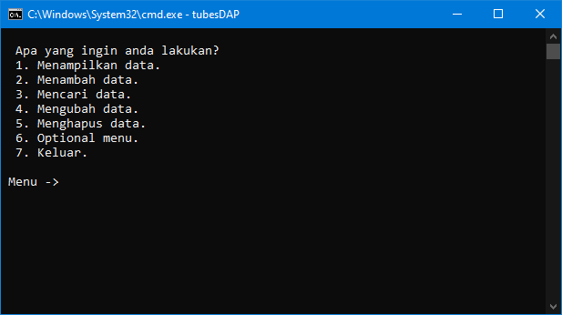

# Tugas Besar DAP (Dasar Algoritma dan Pemrograman)

## Deskripsi
Program ini merupakan tugas akhir wajib untuk syarat kelulusan untuk mata kuliah **DAP** di prodi **RPL(Rekayasa Perangkat Lunak)** di telkom university. Program ini menggunakan typeData bentukan tentang mahasiswa yang diprogram untuk dapat melakukan:
 1. Menampilkan Data.
	 - Pengururan Data Increment Berdasarkan NIM atau Nama Mahasiswa.
	 - Pengurutan Data Decrement Berdasarkan NIM atau Nama Mahasiswa.
 2. Menambah Data.
 3. Mencari Data Berdasarkan Semua Field.
 4. Mengubah Data.
 5. Menghapus Data.
 6. Data to file .txt.
	 - Export.
	 - Read.
	 - Delete.

## How To Run
 1. Buka cmd di direktori program.
 2. Ketik `go build` di cmd.
 3. Ketik nama dari folder example: `tubesDAP` di cmd.

## Notes
Gunakan program ini sebagai referensi bukan untuk plagiarisme.